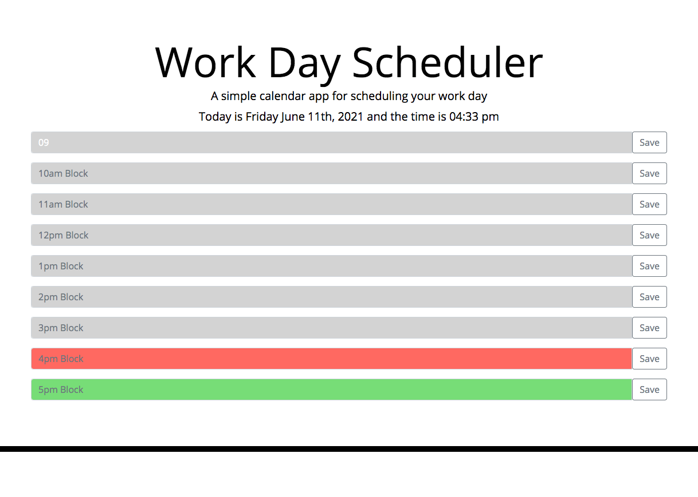

# Day Planner
## Description
I was assigned to create a day planner. I used this project as further practice in JavaScript and to familiarize myself a little with moment.js. Although, my js logic seems to work as it should, this interation of the planner isn't DRY at all. Hopefully in the future Ill be able to refactor this project.

## Table of Contents
- [Installation](#installation)
- [Usage](#usage)
- [Credits](#credits)
- [License](#license)

## Installation
No installs required. Works best on an updated browser.

## Usage
Type into any block your plans for the day and then hit the save button. Your list items should be saved into your local storage and the next time you come to the page, your previous entries should be right where you left them.

## Credits
Shout out to teacher Leif for helping me retreive my data from local storage. The fix was that I needed to move the call function of the function itself.

## License
This is free and unencumbered software released into the public domain.

Anyone is free to copy, modify, publish, use, compile, sell, or distribute this software, either in source code form or as a compiled binary, for any purpose, commercial or non-commercial, and by any means.

In jurisdictions that recognize copyright laws, the author or authors of this software dedicate any and all copyright interest in the software to the public domain. We make this dedication for the benefit of the public at large and to the detriment of our heirs and successors. We intend this dedication to be an overt act of relinquishment in perpetuity of all present and future rights to this software under copyright law.

THE SOFTWARE IS PROVIDED "AS IS", WITHOUT WARRANTY OF ANY KIND, EXPRESS OR IMPLIED, INCLUDING BUT NOT LIMITED TO THE WARRANTIES OF MERCHANTABILITY, FITNESS FOR A PARTICULAR PURPOSE AND NONINFRINGEMENT. IN NO EVENT SHALL THE AUTHORS BE LIABLE FOR ANY CLAIM, DAMAGES OR OTHER LIABILITY, WHETHER IN AN ACTION OF CONTRACT, TORT OR OTHERWISE, ARISING FROM, OUT OF OR IN CONNECTION WITH THE SOFTWARE OR THE USE OR OTHER DEALINGS IN THE SOFTWARE.

For more information, please refer to http://unlicense.org/